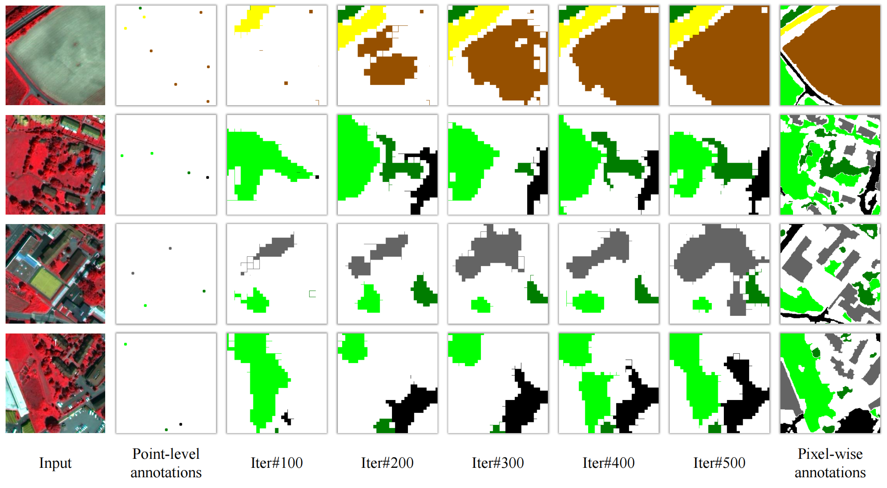

<h1 align="center">Consistency-Regularized Region-Growing Network for Semantic Segmentation of Urban Scenes with Point-Level Annotations</h1>

<h3 align="center"> <a href="https://yonghaoxu.github.io/">Yonghao Xu</a> and <a href="http://pedram-ghamisi.com/">Pedram Ghamisi</a></h3>
<br
 


*This research has been conducted at the [Institute of Advanced Research in Artificial Intelligence (IARAI)](https://www.iarai.ac.at/).*
    
This is the official PyTorch implementation of the weakly supervised semantic segmentation method for very high-resolution remote sensing image in our paper **[Consistency-Regularized Region-Growing Network for Semantic Segmentation of Urban Scenes with Point-Level Annotations](https://arxiv.org/abs/2202.03740)**.
    
### Table of content
 1. [Preparation](#preparation)
 2. [Usage](#usage)
 3. [Paper](#paper)
 4. [Results](#results)
 5. [Acknowledgement](#acknowledgement)
 6. [License](#license)

### Preparation
- Package requirements: The scripts in this repo are tested with `torch==1.8` and `torchvision==0.9` using a single NVIDIA Tesla V100 GPU.
- Remote sensing datasets used in this repo:
  - [Vaihingen dataset](http://www2.isprs.org/commissions/comm3/wg4/2d-sem-label-vaihingen.html)
  - [Zurich Summer dataset](https://zenodo.org/record/5914759)
  - [Point-level annotations](https://github.com/Hua-YS/Semantic-Segmentation-with-Sparse-Labels) (please convert the annotation files into the `.png` format, where the pixel values range from `0` to `num_classes-1`)
- Pretrained models:
  - [ImageNet pretrained VGG-16 model](https://drive.google.com/file/d/1PGuOb-ZIOc10aMGOxj5xFSubi8mkVXaq/view)
- Data folder structure
  - The data folder is structured as follows:

```
├── <THE-ROOT-PATH-OF-DATA>/
│   ├── Vaihingen/     
|   |   ├── img/
|   |   ├── gt/
|   |   ├── point/
|   |   |   ├── an1/
|   |   |   ├── an2/
|   |   |   ├── an3/
|   |   |   ├── an4/
│   ├── Zurich/    
|   |   ├── img/
|   |   ├── gt/
|   |   ├── point/
|   |   |   ├── an1/
|   |   |   ├── an2/
|   |   |   ├── an3/
|   |   |   ├── an4/

```

### Usage
- Pretrain the region-growing network:
```
CUDA_VISIBLE_DEVICES=0 python CRGNet_Vaihingen.py
CUDA_VISIBLE_DEVICES=0 python CRGNet_Zurich.py
```
Alternatively, you can download our pretrained models on [Vaihingen](https://drive.google.com/file/d/1hJSSe1fXcH57FcDELD58omcx2jrDYZr1/view?usp=sharing) or [Zurich Summer](https://drive.google.com/file/d/1xM8maq0_tMN0MLifFcJ7bAzaBzNZGC3j/view?usp=sharing) for a quick look.
- Generate pseudo labels:
```
CUDA_VISIBLE_DEVICES=0 python GenVaihingen.py
CUDA_VISIBLE_DEVICES=0 python GenZurich.py
```
- Finetue the network with pseudo labels:
```
CUDA_VISIBLE_DEVICES=0 python SelfTrain_Vaihingen.py
CUDA_VISIBLE_DEVICES=0 python SelfTrain_Zurich.py
```
- Evaluate the performance on test set:
```
CUDA_VISIBLE_DEVICES=0 python TestVaihingen.py 
CUDA_VISIBLE_DEVICES=0 python TestZurich.py 
```

### Results
- Dynamically expanded annotations in different iterations:


- Example segmentation results of an image in the test set on the Zurich Summer dataset:


- Performance contribution of each module in CRGNet (reported in mean F1):

|  Method  | RG | CR | ST | dCRF | Vaihingen | Zurich Summer |
|:--------:|:--:|:--:|:--:|:----:|:---------:|:-------------:|
| Baseline |    |    |    |      |   61.63   |     60.13     |
|    +RG   |  √ |    |    |      |   63.89   |     65.58     |
|    +CR   |  √ |  √ |    |      |   65.48   |     68.61     |
|    +ST   |  √ |  √ |  √ |      |   68.07   |     71.26     |
|   +dCRF  |  √ |  √ |  √ |   √  |   70.92   |     75.68     |

### Paper
**[Consistency-regularized region-growing network for semantic segmentation of urban scenes with point-level annotations](https://arxiv.org/abs/2202.03740)**

Please cite the following paper if the code is useful for your research:

```
@article{uaers,
  title={Consistency-regularized region-growing network for semantic segmentation of urban scenes with point-level annotations}, 
  author={Xu, Yonghao and Ghamisi, Pedram},
  journal={IEEE Trans. Image Process.},  
  volume={},
  pages={},
  year={2022},
}
```

### Acknowledgement
The authors would like to thank the International Society for Photogrammetry and Remote Sensing (ISPRS), and the German Society for Photogrammetry, Remote Sensing and Geoinformation (DGPF) for providing the Vaihingen dataset, and Dr. Michele Volpi for providing the Zurich Summer dataset.

[Lovász-Softmax loss](https://github.com/bermanmaxim/LovaszSoftmax)

[PyDenseCRF](https://github.com/lucasb-eyer/pydensecrf)

### License
This repo is distributed under [MIT License](https://github.com/YonghaoXu/CRGNet/blob/main/LICENSE). The code can be used for academic purposes only.
